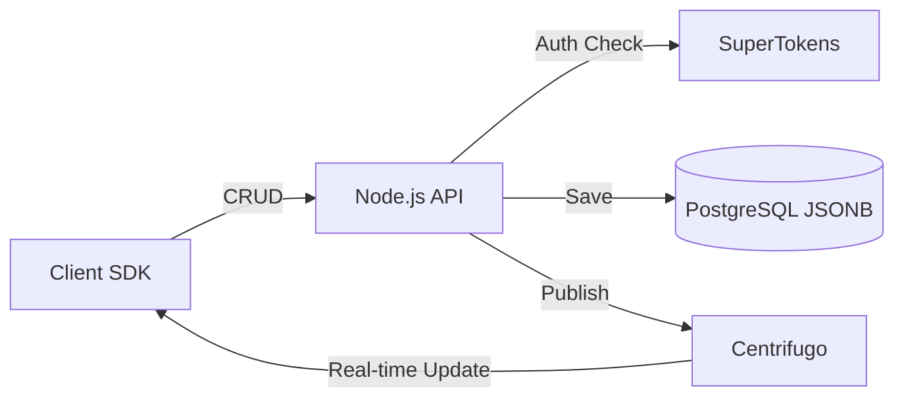

# Building a Firestore Alternative: "Telestack-Firestore"

This guide outlines how to build a scalable, real-time, document-oriented database by merging open-source projects. To achieve "Firebase-like" functionality, we will use:

*   **Database**: PostgreSQL with `JSONB` **OR** [Cloudflare D1](https://developers.cloudflare.com/d1/) (SQLite-based JSON).
*   **Auth**: SuperTokens (Already in your stack).
*   **Real-time engine**: [Centrifugo](https://centrifugo.io/) (Handles massive WebSocket scaling).
*   **Storage**: [MinIO](https://min.io/) or [Backblaze B2](https://www.backblaze.com/b2/cloud-storage.html).

---

## 🏗️ Architecture Overview

The system works by keeping clients connected via WebSockets to Centrifugo. When a client writes to the API, the API updates PostgreSQL and then publishes a "change message" to Centrifugo, which broadcasts it to all interested listeners.



---

## 📂 Phase 1: The Document Store (PostgreSQL)

Traditional NoSQL databases (like Firestore) store data as JSON. PostgreSQL's `JSONB` type is perfect for this.

### 1. Database Schema
Create a table that allows dynamic collections.

```sql
CREATE EXTENSION IF NOT EXISTS "uuid-ossp";

CREATE TABLE documents (
    id UUID PRIMARY KEY DEFAULT uuid_generate_v4(),
    collection_name TEXT NOT NULL,
    user_id TEXT NOT NULL, -- Owner from SuperTokens
    data JSONB NOT NULL,   -- The actual document
    created_at TIMESTAMP WITH TIME ZONE DEFAULT CURRENT_TIMESTAMP,
    updated_at TIMESTAMP WITH TIME ZONE DEFAULT CURRENT_TIMESTAMP
);

-- Index for fast collection-based queries
CREATE INDEX idx_collection_name ON documents(collection_name);
-- GIN Index for searching INSIDE the JSON data
CREATE INDEX idx_documents_data ON documents USING GIN (data);
```

---

## ☁️ Phase 1.5: Using Cloudflare D1 (Serverless Path)

If you are already in the Cloudflare ecosystem, D1 is an excellent choice for a document store using SQLite's JSON functions.

### 1. D1 Schema
```sql
CREATE TABLE documents (
    id TEXT PRIMARY KEY,
    collection_name TEXT NOT NULL,
    user_id TEXT NOT NULL,
    data TEXT NOT NULL, -- Stored as JSON string
    created_at DATETIME DEFAULT CURRENT_TIMESTAMP,
    updated_at DATETIME DEFAULT CURRENT_TIMESTAMP
);
```

### 2. Writing to D1 & Publishing to Centrifugo
From a Cloudflare Worker, you can use the `fetch()` API to talk to Centrifugo's HTTP API.

```javascript
export default {
  async fetch(request, env) {
    const { collection, data, userId } = await request.json();

    // 1. Save to D1
    await env.DB.prepare(
      "INSERT INTO documents (id, collection_name, user_id, data) VALUES (?, ?, ?, ?)"
    ).bind(crypto.randomUUID(), collection, userId, JSON.stringify(data)).run();

    // 2. Publish to Centrifugo via Node/Worker Fetch API
    await fetch("https://your-centrifugo.com/api", {
      method: "POST",
      headers: {
        "Content-Type": "application/json",
        "Authorization": `apikey ${env.CENTRIFUGO_API_KEY}`
      },
      body: JSON.stringify({
        method: "publish",
        params: {
          channel: `collection:${collection}`,
          data: { type: "CREATED", data }
        }
      })
    });

    return new Response("Document created and synced!");
  }
}
```

### 3. Querying JSON in D1
```sql
-- Find users where age is greater than 25 in the JSON 'data' column
SELECT * FROM documents 
WHERE collection_name = 'users' 
AND json_extract(data, '$.age') > 25;
```

---

## ⚡ Phase 2: Real-time Infrastructure (Centrifugo)

Centrifugo is the "secret sauce." It handles the WebSocket connections so your API remains stateless and scalable.

1.  **Run Centrifugo**: Use Docker.
2.  **Config**: Enable "API key" so your Node.js backend can publish messages.
3.  **Client Connection**: Clients connect to Centrifugo using a JWT (generated by your API) to ensure they only listen to channels they are allowed to.

---

## 🔒 Phase 3: The API & Security Rules

You need a middleware that mimics Firestore Security Rules.

### 1. SuperTokens Verification
```javascript
import Session from "supertokens-node/recipe/session";

async function createDocument(req, res) {
    let session = await Session.getSession(req, res);
    let userId = session.getUserId(); // This is the SuperTokens ID

    const { collection, data } = req.body;

    // Security Rule Check (Example: only 'admin' can write to 'config')
    if (collection === 'config' && !isAdmin(userId)) {
        return res.status(403).send("Forbidden");
    }

    // Write to Postgres
    const doc = await db.query(
        'INSERT INTO documents (collection_name, user_id, data) VALUES ($1, $2, $3) RETURNING *',
        [collection, userId, data]
    );

    // Notify Centrifugo
    await centrifuge.publish(`collection:${collection}`, {
        type: 'CREATED',
        doc: doc.rows[0]
    });

    res.json(doc.rows[0]);
}
```

---

## 📱 Phase 4: Client SDK (Example)

Mimicking the `onSnapshot` behavior of Firestore.

```javascript
import { Centrifuge } from 'centrifuge';

const centrifuge = new Centrifuge('ws://your-centrifugo-url/connection/websocket', {
    token: 'JWT_FROM_YOUR_API'
});

// Subscribe to a collection
const sub = centrifuge.newSubscription('collection:posts');

sub.on('publication', (ctx) => {
    console.log("Real-time update received:", ctx.data);
    // Update local state (React/Vue/etc.)
});

sub.subscribe();
```

---

## 🚀 Key Advantages of this Stack

1.  **Ownership**: You own the data in PostgreSQL; no vendor lock-in.
2.  **Performance**: PostgreSQL JSONB is extremely fast and supports complex joins that Firestore cannot do.
3.  **Scalability**: Centrifugo can handle millions of concurrent connections.
4.  **Cost**: Fraction of the cost of Firebase at scale.

## 🛠️ Next Steps

1.  **Setup Postgres**: Host it on Supabase (optional) or a local Docker container.
2.  **Deploy Centrifugo**: Use the official [Docker image](https://hub.docker.com/r/centrifugo/centrifugo).
3.  **Bridge Logic**: Create a small Node.js service to handle the CRUD and Centrifugo publishing.

> [!TIP]
> **Pro Tip**: Use `PostgREST` if you want to automatically turn your Postgres tables into a REST API without writing much Node.js code!
